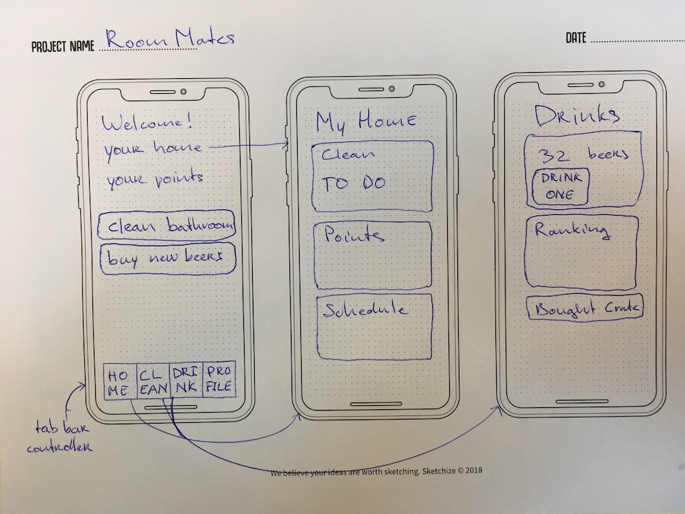

# Final Project App Studio (iOS)
Final project minor Programmeren UvA

## Problem Statement
Students often live with multiple roommates. Keeping things clean can be quite hard, especially when using paper and pen to draw out an to-do scheme for everyone, which in turn gets lost. 

## Solution
A simple application, named 'RoomMates' (or in Dutch: 'Huisgenoten') could make it easy to create a to-do list for everyone in the house, all customized. Students could benefit from an easy-to-create scheme which can notify them when something has to be done. The scheme could entail some kind of points system, in which points can be rewarded or deducted. 

In addition, I'd like to add a simple 'dash' system for beer. (something like WieBetaaltWat, but not with money). Eventually, the app could grow to some kind of social media platform for your house to store e.g. photos and create shopping lists. It could even be possible to connect to neighbours to improve contact and fix bad relationships.

### Visual Sketch

### Main Features
This is a list of the apps main features. Some are optional and many are missing, but I hope the idea is clear.

Tab Bars (modes):
* 'Home'
  * Your Home
  * Your Points
* Clean
  * Cleaning schedule
  * Point system (house ranking)
  * TO DO
  * Create Schedule
  * Add 'Dirty Dishes' :sponge:
* Drinks
  * Beers (current amount)
  * Drink one
  * Bought Crate
  * Drinking History
* Profile
  * Your Account (login, logout)
  * Move In
  * Move out

## Prerequisites

### Data Sources
* Data file which contains user accounts
* Data file which contains information for a house, a person, etc..
 * This can be done with the help of Google Firebase

### External Components
* JSON data structure from Google Firebase
 * log in with authentication
 * real time database

### Similar Applications
These applications don't specifically serve the goal I have in mind, but could be used for keeping track of drink expenses and cleaning schedules.
* There are many TO DO applications, like Wunderlist, Evernote, etc...
* WieBetaaltWat is often used to divide students expenses
* OurHome is something similar for families. I think it's way too complicated and not very user friendly.

### Hardest Challenges
Setting up a cleaning schedule should be easy. The hard part will be when users want to enter personal preferences. Just a weekly schedule should be doable, but in the end, this app should be easier to use then drawing a cleaning schedule with pen and paper and pin it up on the refrigerator.

